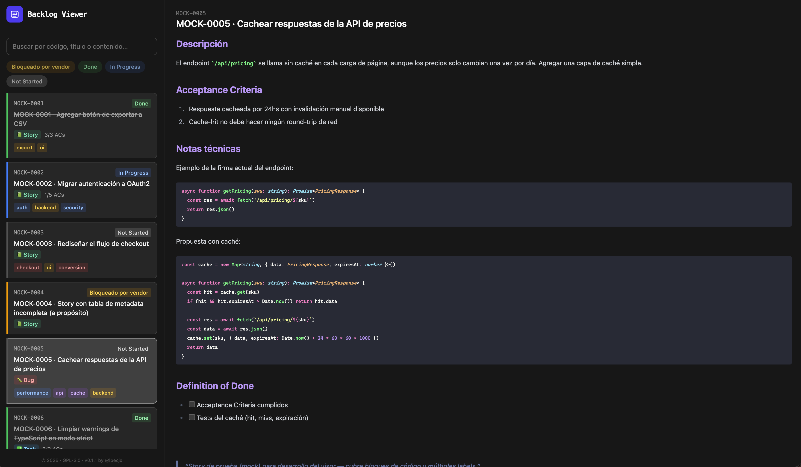

# Backlog Viewer



Development source for the viewer used by the [`local-backlog`](https://github.com/lbecjx/local-backlog) Claude Code plugin. This
repo is never installed by anyone — only its compiled `dist/` output ships inside the
plugin. See `docs/STORY_LOCAL_BACKLOG_VIEWER.md` for the full design and rationale.

## Running locally

The app reads stories live via `fetch()` against a real directory listing — Vite's own
dev server doesn't generate one, so local development needs a second process standing
in for the `python3 -m http.server` the published plugin uses in production:

```bash
# Terminal 1 — serves public/backlog/ with a real, auto-generated directory listing
pnpm dev:server

# Terminal 2 — the app itself; proxies /backlog/* to the server above (see vite.config.ts)
pnpm dev
```

Both need to be running. `public/backlog/` holds mock stories (`MOCK-000X-*.md`) used
for development — edit, add, or delete them and refresh the browser to see the live-read
mechanism in action; no build or regeneration step required.

## Stack

React + TypeScript + Vite + Tailwind CSS v4, managed with pnpm. See
`.workflow-dev/context/REPO.md` for the full stack rationale and conventions.

## License

Licensed under the GNU General Public License v3.0 or later — see [LICENSE](./LICENSE) for the full text.

```
Backlog Viewer — a Markdown story viewer for the local-backlog plugin
Copyright (C) 2026  Luis Becerra

This program is free software: you can redistribute it and/or modify
it under the terms of the GNU General Public License as published by
the Free Software Foundation, either version 3 of the License, or
(at your option) any later version.

This program is distributed in the hope that it will be useful,
but WITHOUT ANY WARRANTY; without even the implied warranty of
MERCHANTABILITY or FITNESS FOR A PARTICULAR PURPOSE. See the
GNU General Public License for more details.

You should have received a copy of the GNU General Public License
along with this program. If not, see <https://www.gnu.org/licenses/>.
```

Author: Luis Becerra ([@lbecjx](https://github.com/lbecjx))
